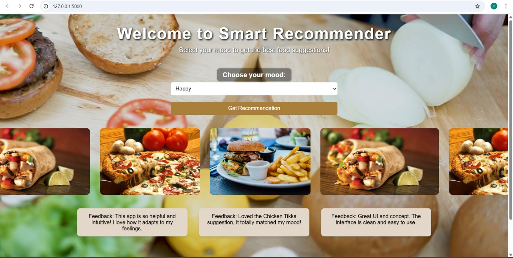
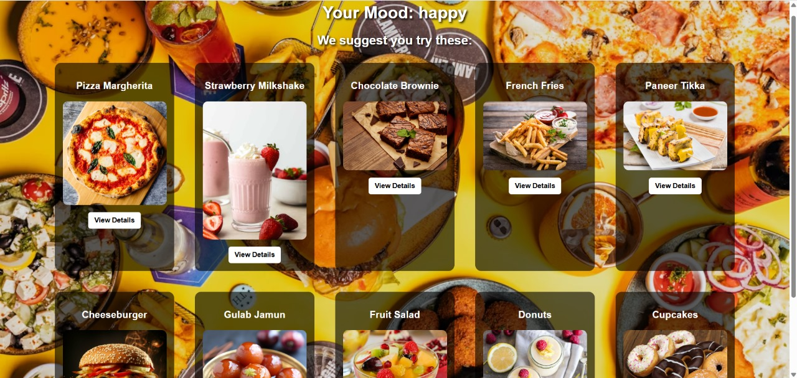
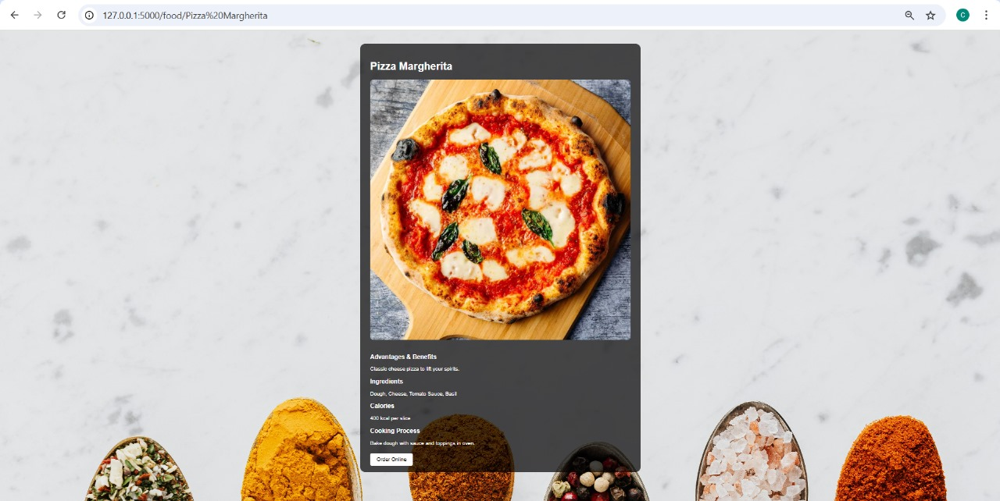
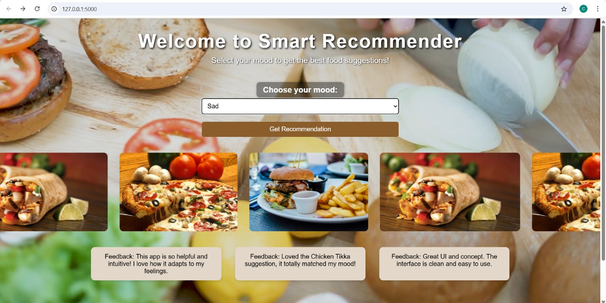
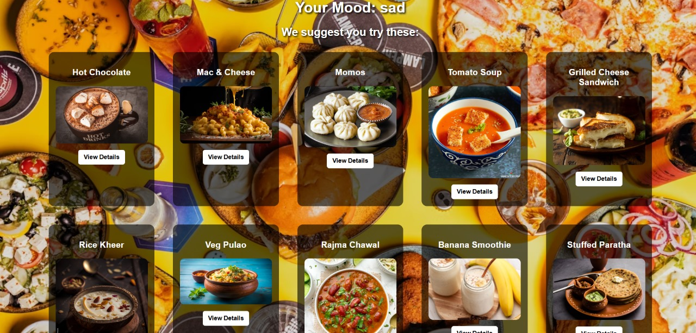
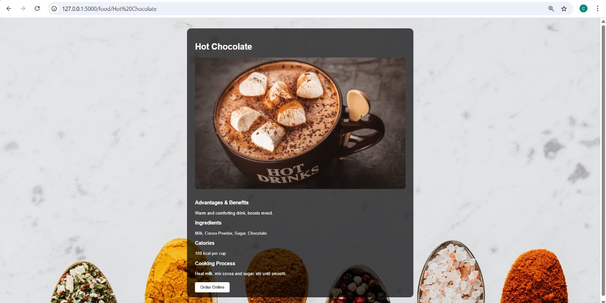

# Mood-Based Food Recommender

Welcome to **Smart Recommender** — a Flask-based mood-driven food suggestion system. This project suggests delicious dishes based on the user's emotional state.

---

                    ## Team Members

-  S.K. Suhana Anjum  
-  B. Sai Thanusree  
-  B. Pranathi  
- R. Supraja  

---

                       ## Features

- Select mood: Happy,  Sad,  Excited,  Tired
- Get **14 customized food recommendations per mood**
- View detailed food information:
  -  Ingredients
  -  Calories
  -  Health Benefits
  -  Cooking Process
  -  YouTube Video
  -  Image + Order Button
- Clean UI using HTML, CSS, and inline styles
- Deployable to Render.com

---

                     ##  Project Structure

moodfood/
├── static/
├── templates/
│ ├── index.html
│ ├── recommendation.html
│ ├── result.html
│ └── food_detail.html
├── app.py
├── check_db.py
├── init_db.py
├── recommender.db
├── Procfile
├── render.yaml
└── requirements.txt


               ##  How to Run Locally

   1. **Clone the repo**
   ```bash
   git clone <your-repo-url>
   cd moodfood

   2.Set up a virtual environment
         python -m venv venv
         source venv/bin/activate

   3.Install the dependencies
          pip install -r requirements.txt

   4.Initialize the database
           python init_db.py

   5.Run the app
          python app.py

   6.Open browser and go to http://127.0.0.1:5000 


                          ###Screenshots

  


















                       ###Technologies Used
Python 3.10+

Flask

SQLite

HTML5 & CSS3

Bootstrap (minimal inline usage)

Render Deployment

                           ###License
This project is for academic and demonstration purposes only.